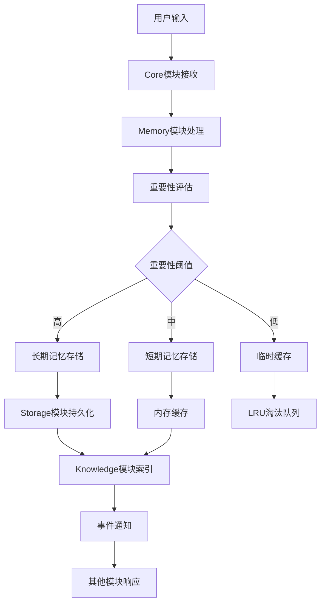
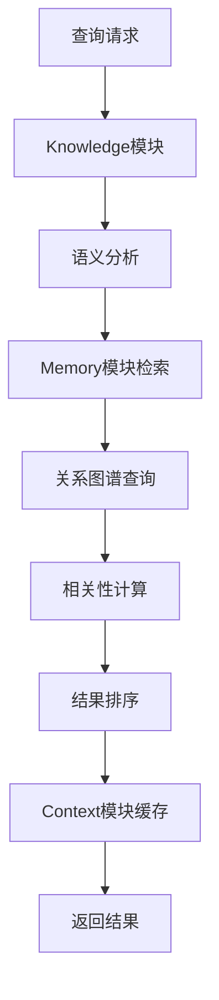
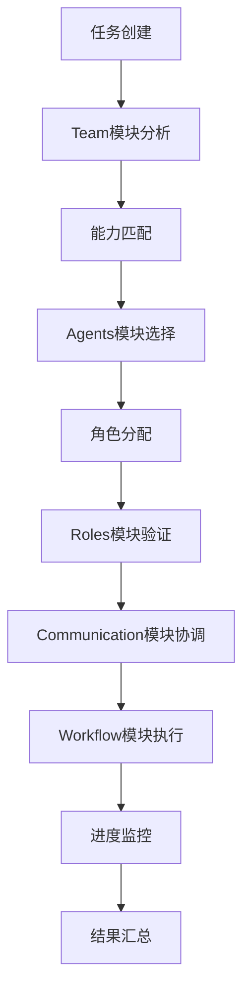
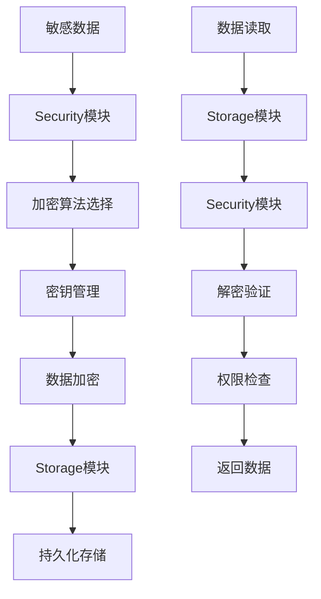
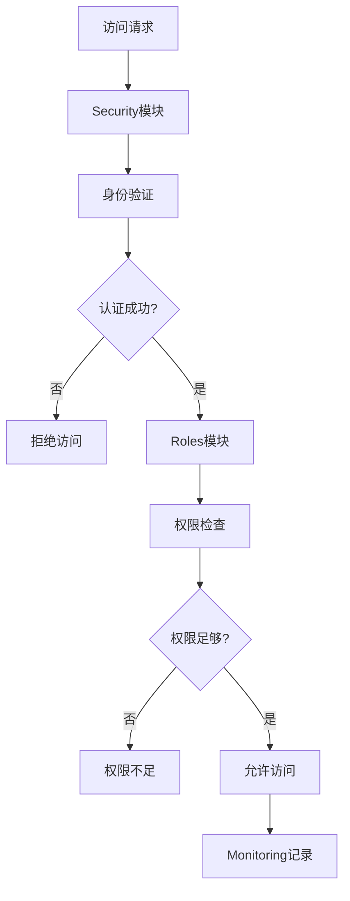
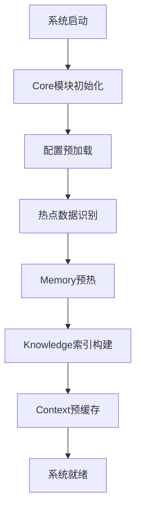
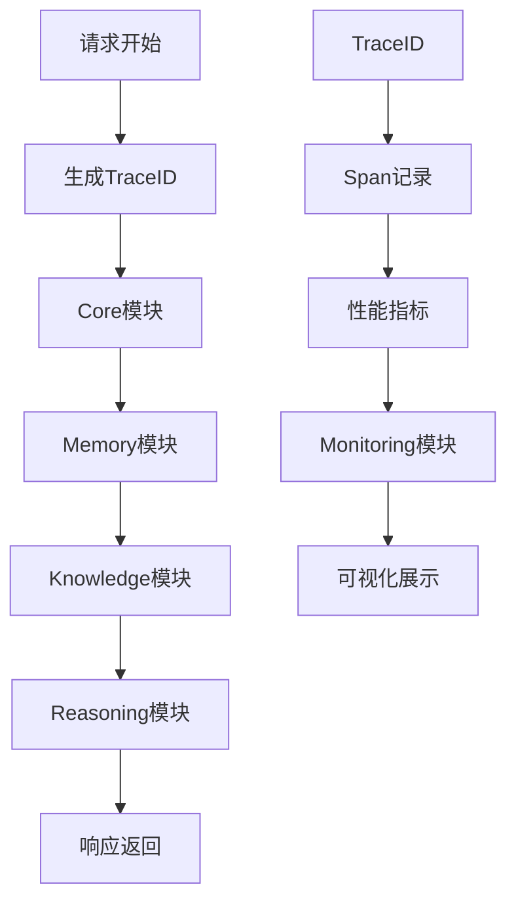
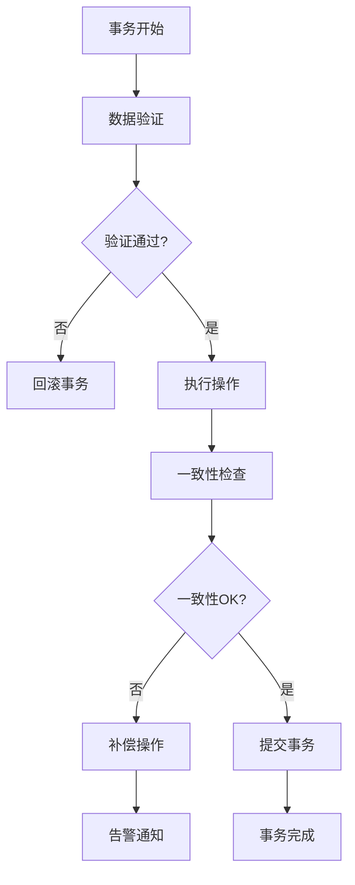
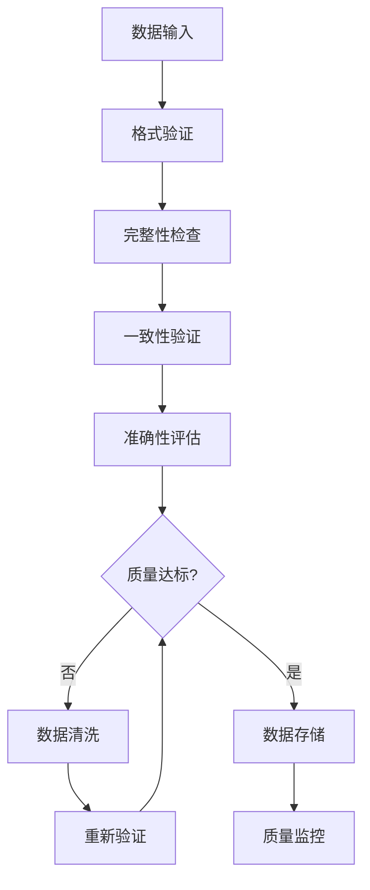

# MJOS 数据流和交互设计

> **最后更新时间**: 2025-07-17 09:12:30 UTC  
> **文档版本**: v2.0.0  
> **更新内容**: 创建完整的数据流和模块交互设计文档

## 📋 概述

本文档详细描述了MJOS系统中数据的流动路径、模块间的交互模式，以及关键业务流程的实现机制。

## 🌊 核心数据流

### 1. 记忆存储流程



### 2. 知识查询流程



### 3. 智能体协作流程



## 🔄 模块交互模式

### 事件驱动交互

#### 事件类型定义
```typescript
interface SystemEvent {
  type: string;
  source: string;
  target?: string;
  data: any;
  timestamp: number;
  correlationId?: string;
}
```

#### 核心事件流
```typescript
// 记忆相关事件
'memory.stored' -> Knowledge, Context, Monitoring
'memory.retrieved' -> Context, Performance
'memory.expired' -> Storage, Monitoring

// 知识相关事件
'knowledge.added' -> Memory, Reasoning, Agents
'knowledge.updated' -> Context, Workflow
'knowledge.queried' -> Performance, Monitoring

// 智能体相关事件
'agent.created' -> Team, Roles, Monitoring
'agent.task.assigned' -> Workflow, Communication
'agent.task.completed' -> Team, Performance

// 系统事件
'system.started' -> All modules
'system.error' -> Monitoring, Security
'system.shutdown' -> All modules
```

### 同步vs异步交互

#### 同步交互场景
- 配置读取和验证
- 权限检查和认证
- 关键数据查询
- 错误处理和恢复

#### 异步交互场景
- 记忆存储和索引
- 知识图谱更新
- 性能指标收集
- 日志记录和审计

## 📊 数据模型和流转

### 核心数据实体

#### Memory Entity
```typescript
interface Memory {
  id: string;
  content: any;
  tags: string[];
  importance: number;
  type: MemoryType;
  createdAt: Date;
  lastAccessed: Date;
  accessCount: number;
  metadata: MemoryMetadata;
}
```

#### Knowledge Entity
```typescript
interface KnowledgeItem {
  id: string;
  content: any;
  type: KnowledgeType;
  metadata: KnowledgeMetadata;
  relationships: KnowledgeRelationship[];
  version: number;
  createdAt: Date;
  updatedAt: Date;
}
```

#### Agent Entity
```typescript
interface Agent {
  id: string;
  name: string;
  type: AgentType;
  capabilities: Capability[];
  configuration: AgentConfiguration;
  state: AgentState;
  performance: PerformanceMetrics;
}
```

### 数据流转路径

#### 1. 用户输入 → 系统响应
```
用户输入 → API/CLI → Core → 业务模块 → 存储 → 响应
```

#### 2. 记忆形成过程
```
原始数据 → Memory → 重要性评估 → 分类存储 → Knowledge索引 → Context缓存
```

#### 3. 智能推理过程
```
问题输入 → Context → Memory检索 → Knowledge查询 → Reasoning处理 → 结果输出
```

#### 4. 协作任务执行
```
任务定义 → Team分析 → Agent分配 → Workflow执行 → Communication协调 → 结果汇总
```

## 🔐 数据安全和隐私

### 数据加密流程


### 访问控制流程


## 📈 性能优化策略

### 缓存策略
```typescript
interface CacheStrategy {
  // L1缓存：内存缓存
  memoryCache: {
    maxSize: number;
    ttl: number;
    evictionPolicy: 'LRU' | 'LFU' | 'FIFO';
  };
  
  // L2缓存：Redis缓存
  redisCache: {
    cluster: boolean;
    persistence: boolean;
    compression: boolean;
  };
  
  // L3缓存：数据库缓存
  dbCache: {
    queryCache: boolean;
    resultCache: boolean;
    indexOptimization: boolean;
  };
}
```

### 数据预加载


### 批处理优化
```typescript
interface BatchProcessor {
  batchSize: number;
  flushInterval: number;
  maxWaitTime: number;
  
  process(items: any[]): Promise<void>;
  flush(): Promise<void>;
}
```

## 🔍 监控和观测

### 数据流监控点
```typescript
interface DataFlowMetrics {
  // 吞吐量指标
  throughput: {
    requestsPerSecond: number;
    dataVolumePerSecond: number;
    peakThroughput: number;
  };
  
  // 延迟指标
  latency: {
    averageLatency: number;
    p95Latency: number;
    p99Latency: number;
  };
  
  // 错误率指标
  errorRate: {
    totalErrors: number;
    errorPercentage: number;
    errorsByType: Record<string, number>;
  };
}
```

### 链路追踪


## 🚨 错误处理和恢复

### 错误传播机制
```typescript
interface ErrorHandling {
  // 错误分类
  errorTypes: {
    SYSTEM_ERROR: 'system';
    BUSINESS_ERROR: 'business';
    NETWORK_ERROR: 'network';
    DATA_ERROR: 'data';
  };
  
  // 错误处理策略
  strategies: {
    retry: RetryStrategy;
    fallback: FallbackStrategy;
    circuitBreaker: CircuitBreakerStrategy;
  };
}
```

### 数据一致性保证


## 📋 数据治理

### 数据生命周期管理
```typescript
interface DataLifecycle {
  creation: {
    validation: boolean;
    encryption: boolean;
    classification: boolean;
  };
  
  usage: {
    accessLogging: boolean;
    usageTracking: boolean;
    performanceMonitoring: boolean;
  };
  
  archival: {
    retentionPolicy: RetentionPolicy;
    compressionStrategy: CompressionStrategy;
    migrationRules: MigrationRules;
  };
  
  deletion: {
    secureErasure: boolean;
    auditTrail: boolean;
    complianceCheck: boolean;
  };
}
```

### 数据质量保证


---

**维护团队**: MJOS架构团队  
**审查周期**: 每月一次  
**下次更新**: 2025-08-17
